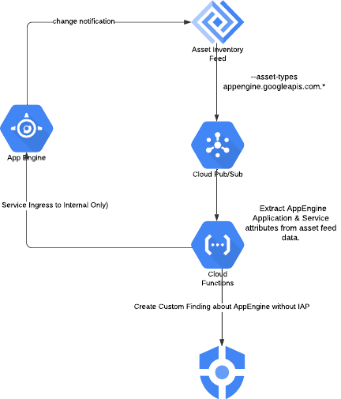

# Using SCC Custom Findings and Asset Inventory Feeds to auto-remediate non-compliant GCP resources

## The problem

At the time of this writing the capability to enforce settings to resources via organizational policies (both canned and custom) is limited to a list of asset types. Also from a detection point of view even when in addition to out of the box Security Command Center detectors we can implement Security Health Analytics custom modules the list of asset types supported doesn’t include some services like App Engine.


## The proposed solution

This custom solution shows automatic remediation use case: how to detect in SCC that IAP is enabled on App Engine and if not enabled automatically change the ingress setting to internal only to revert non-compliant configurations in near-real time

The enforcement point will be set at the organization or folder level but can also be set to a single project (especially for testing)

This example Terraform and Python(Cloud Function) code demonstrates how to leverage a custom solution based on Cloud Asset Inventory feeds, Cloud Functions and Security Command Center to identify non-compliant GCP resources and auto-remediate it to make them compliant with a well defined security posture



The example provided shows how to remediate App Engine services without IAP and change its ingress setting to Internal Only and create a custom findings published to SCC(The code can be extended to include more assets and custom remediation logic to cover a broader set of resources).


## Run the code

To run the code the following pre-requisite is required:

* The organization ID
* A Google Cloud project created with the following APIS enabled:
    * cloudresourcemanager.googleapis.com
    * serviceusage.googleapis.com
* The folder ID (only required in case of calling the folder level asset feed)

Here is the example for calling the modules:

* Organization level remediation

```terraform
module "asset-feed-remediation-organization" {
  source         = "./modules/app-engine-remediation/organization-level-feed"
  project_id = var.project_id
  organization_id = var.organization_id
  name = var.name
  region = var.region
  source_dir = var.source_dir
}
```

* Folder level remediation
```terraform
module "asset-feed-remediation-folder" {
  source         = "./modules/app-engine-remediation/folder-level-feed"
  folder_id = var.folder_id #Only required when creating a folder level feed
  project_id = var.project_id
  organization_id = var.organization_id
  name = var.name
  region = var.region
  source_dir = var.source_dir
}
```

* Project level remediation
```terraform
module "asset-feed-remediation-project" {
  source         = "./modules/app-engine-remediation/project-level-feed"
  project_id = var.project_id
  organization_id = var.organization_id
  name = var.name
  region = var.region
  source_dir = var.source_dir
}
```

## Test the solution

Create any non-compliant resource: App Engine without IAP

## Codebase


The codebase includes the following components:

* Terraform code to create the necessary infrastructure, including the Cloud Function, Pub/Sub topic, and Security Command Center notification config.
* Python code for the Cloud Function that processes the Asset Inventory feed and performs the remediation actions.
* README file with instructions on how to deploy and use the solution.

## Additional resources

* [Cloud Asset Inventory](https://cloud.google.com/asset-inventory/docs/)
* [Cloud Functions](https://cloud.google.com/functions/docs/)
* [Security Command Center](https://cloud.google.com/security-command-center/docs/)
* [Organizational Policies](https://cloud.google.com/resource-manager/docs/organization-policy/overview)
* [Security Health Analytics](https://cloud.google.com/security-command-center/docs/security-health-analytics/overview)

## Copyright 2024 Google LLC

 Licensed under the Apache License, Version 2.0 (the "License");
 you may not use this file except in compliance with the License.
 You may obtain a copy of the License at

     https://www.apache.org/licenses/LICENSE-2.0

 Unless required by applicable law or agreed to in writing, software
 distributed under the License is distributed on an "AS IS" BASIS,
 WITHOUT WARRANTIES OR CONDITIONS OF ANY KIND, either express or implied.
 See the License for the specific language governing permissions and
 limitations under the License.
